# IT3385 Machine Learning Operations Assignment

Visit the Streamlit here: [it3385-mlops-group4.streamlit.app](https://it3385-mlops-group4.streamlit.app)

The GitHub repo can be found here: [https://github.com/hsuenn/IT3385_MLOPS](https://github.com/hsuenn/IT3385_MLOPS).

This document details the installation/deployment guide, for both local hosting and cloud hosting (on Streamlit).

Please see [User Guide](./docs/UserGuide.md) for instructions on how to use the application.


## Contribution of Task 1 and Task 2 (Individual)
- Choo Tze Hsuen \[[220926F_IT3385_Task1_2.ipynb](/src/models/wheat/220926F_IT3385_Task1_2.ipynb), [03_Wheat_Seeds.csv](/data/training/03_Wheat_Seeds.csv)\]
- Ian Chia Bing Jun \[[Task1_Melbourne_EDA_230746D.ipynb](/src/models/melbourne/Task1_Melbourne_EDA_230746D.ipynb), [Task2_Melbourne_model_230746D.ipynb](/src/models/melbourne/Task2_Melbourne_model_230746D.ipynb), [Train_melbourne_clean.csv](/data/training/Train_melbourne_clean.csv)\]
- Muhammad Aniq Sufi Bin Ismail \[[IT3385_Task1_EDA_232237W_AniqSufi.ipynb](/src/models/used_car_prices/IT3385_Task1_EDA_232237W_AniqSufi.ipynb), [IT3385_Task2_232237W_AniqSufi.ipynb](/src/models/used_car_prices/IT3385_Task2_232237W_AniqSufi.ipynb), [Used_Car_Prices_Model_Training.csv](/data/training/Used_Car_Prices_Model_Training.csv)\]

To run the `jupyer notebook` server, please set up the environment as per [source setup](#source-setup) and run `poetry run python -m jupyer notebook` in the root directory of this project.


Models developed by respective team members.
| Name | Admin number | Model |
| ---- | ------------ | ----- |
| Choo Tze Hsuen | 220926F | [Wheat Type (Classification)](/src/streamlit/pages/1_Wheat.py) |
| Ian Chia Bing Jun | 230746D | [Melbourne Residential Prices (Regression)](/src/streamlit/pages/2_Melbourne.py) |
| Muhammad Aniq Sufi Bin Ismail | 2232237W | [Used Car Prices (Regression)](/src/streamlit/pages/3_Used_Car_Prices.py) |


# Local Deployment Guide

This project offers multiple ways to get started.
| Method |   |
| ------ | - |
| Build from source | [Source setup](#source-setup) |
| Docker | [Docker setup](#docker-setup) |

## Source Setup
> [!NOTE]
> A terminal/shell session with Python binary is needed.
> This can be in the form of `py`, `python` or `python3`, depending on your operating system and Python installation method.

The project is packaged and managed by [poetry](https://python-poetry.org/).

To install poetry (on Windows), `pipx` is needed as per [official doc](https://python-poetry.org/docs/#installing-with-the-official-installer):
> [!TIP]
> The following instructions reference the Python binary as `py`, switch out for `python` if your binary is named `python` instead (i.e. Python installed via Microsoft Store has a separate executable name than the one installed with the official installer).
```
# recommend via pipx, install via pip if not yet installed
py -m pip install --user pipx
pipx ensurepath

# install poetry with pipx (recommended by poetry)
pipx install poetry
```

> [!TIP]
> If `pipx` is still not recognised, please see [Troubleshooting Common Problems](#troubleshooting-common-problems). Otherwise, you may refer to their [official installation guide](https://pipx.pypa.io/stable/installation/).


To install poetry (for Linux/MacOS), as per [official doc](https://python-poetry.org/docs/#installing-with-the-official-installer):
```
curl -sSL https://install.python-poetry.org | python -
```
<hr>

> [!NOTE]
> This project requires `Python 3.11.13` Anaconda is used here JUST to provision the Python executable/binary in the required version. Miniconda is preferred here for its lightweight size. At no point is Anaconda used to manage or install dependencies and packages. Poetry does that for us (dependency management and packaging).

To install Anaconda (or Miniconda), please see the following link: [anaconda.com/download/success](https://www.anaconda.com/download/success).

After installing Anaconda (or Miniconda), a terminal restart is required (or by reloading your shell profile e.g. `source ~/.bashrc`, depending on your shell)
```
conda create -n chootzehsuen_it3385_mlops python=3.11.13 -y
conda activate chootzehsuen_it3385_mlops
```

After creating and activating the conda environment, ensure the Python command is referencing the one created by Conda, and is the right version.
```
# for Windows
where python
python --version

# for Linux/MacOS
which python
python --version
```

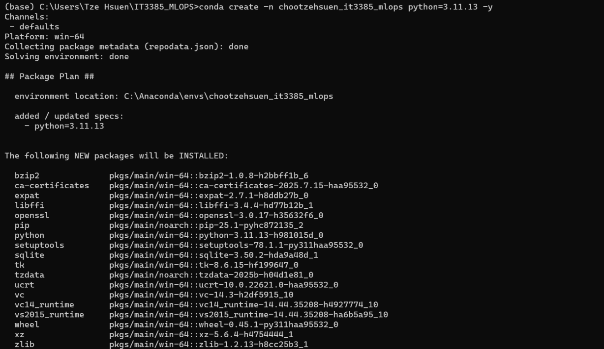
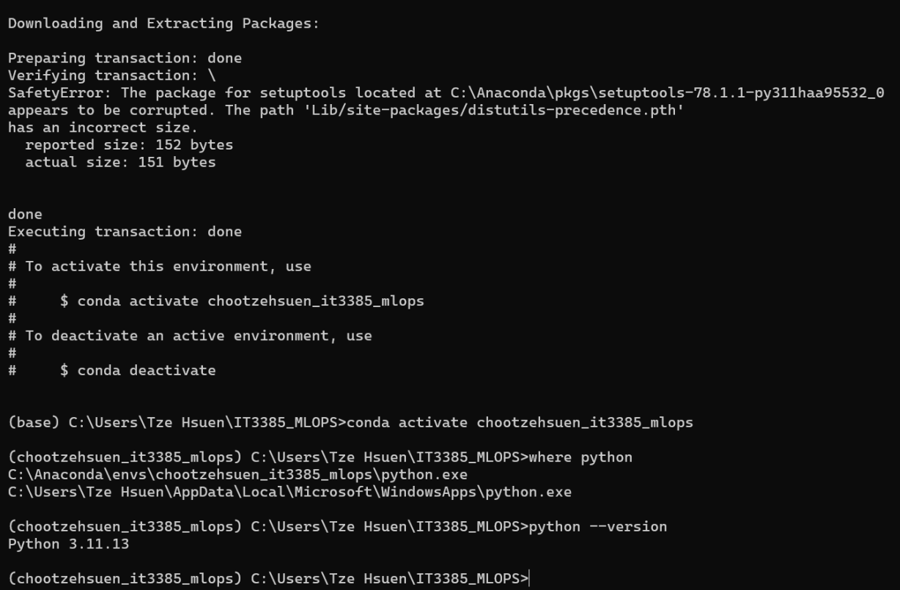
Successful run as the Python binary/executable is the one in the conda environment created, and is the right version of `3.11.13`.
<hr>

Install the project either with `git` or download the zip file archive from this site directly.
```
git clone https://github.com/hsuenn/IT3385_MLOPS
```

Alternatively, you may download the latest zipped release at [/releases](https://github.com/hsuenn/IT3385_MLOPS/releases/tag/stable).
<hr>

After getting poetry installed, install the necessary dependencies and packages:
```
# navigate into the directory
cd IT3385_MLOPS
poetry install
```
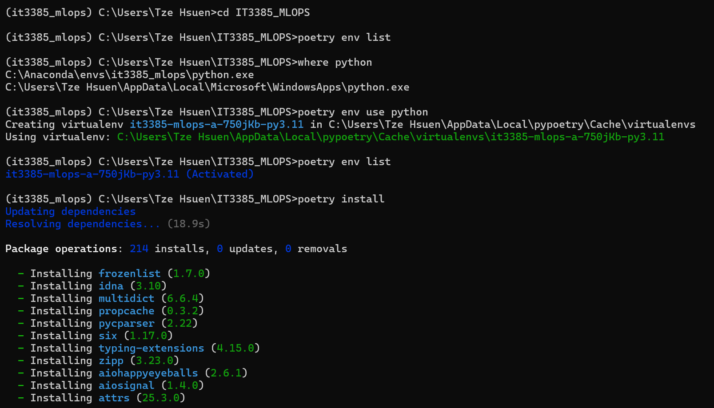
`poetry install` installing dependencies automatically, based on `poetry.lock`.

<hr>

After creating the environment, to start the streamlit server for UI inference.
```
poetry run python -m streamlit run src/streamlit/Home.py
```

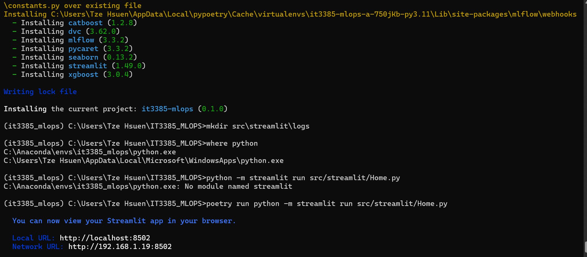
Successful streamlit run.

The frotend server address is outputted to terminal (e.g. `http://localhost:8501`, your browser should automatically load up the page, otherwise manually keying in the address works too).

For common troubleshooting, please see [Troubleshooting Common Problems](#troubleshooting-common-problems).

Please see [User Guide](./docs/UserGuide.md) for instructions on how to use the application.

## Docker Setup
We've pushed a built image (built on amd64 architecture), to pull the built image from the Docker Hub, please run the following.

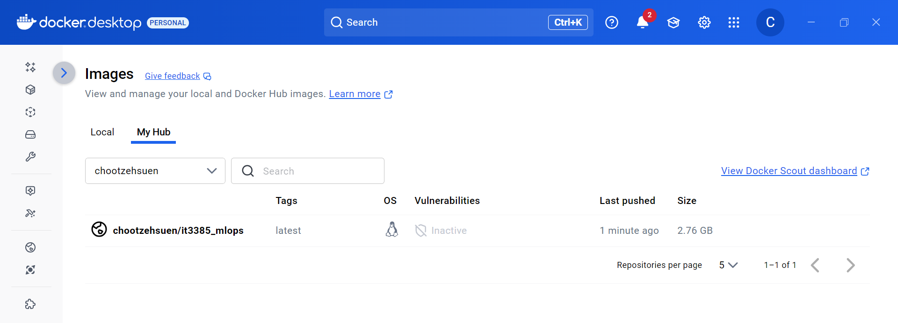
Successful push of built iamge to Docker Hub.

```
# pull the image
docker pull chootzehsuen/it3385_mlops

# spin up a container
docker run -p 8501:8501 chootzehsuen/it3385
```

Alternatively, you may build the docker image yourself if you are on a different cpu architecture.<br>
To do so, you will need clone the repository (in order to get the `Dockerfile`).
```
docker build . -t it3385_mlops
docker run -p 8501:8501 it3385_mlops
```

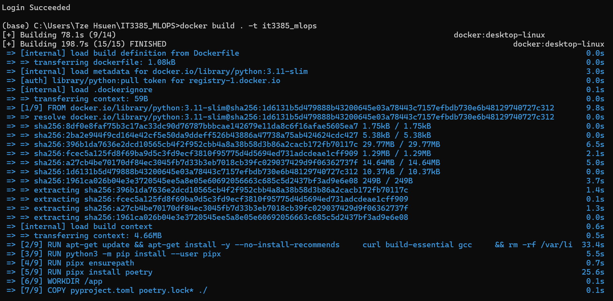
A screenshot of us building the Docker image.

<hr>

Once the container is up and running, simply go to `https://localhost:8501` to access the streamlit server


# Cloud Deployment Guide (on Streamlit)
Deployment is done with [Streamlit](https://streamlit.io/).

1. Fork the repository with GitHub, head over to [share.streamlit.io/deploy](https://share.streamlit.io/deploy) and select the forked repository.
2. Streamlit will deploy with the specified subdomain.


## The CI/CD Strategy We Adopted
`production` branch for deploying on [Streamlit](https://streamlit.io/).

Streamlit automatically tracks the `production` branch and re-deploys whenever changes are made to the branch.

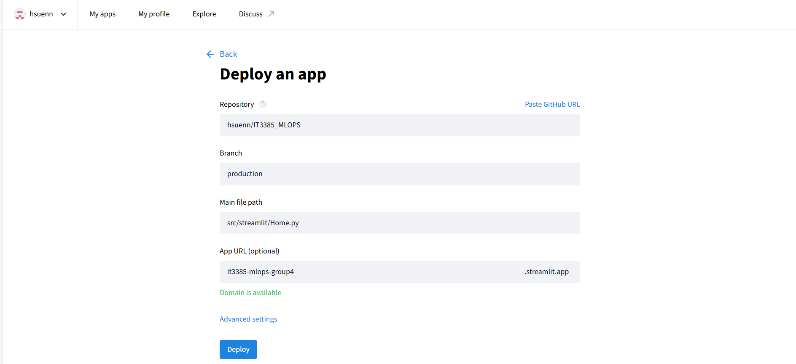


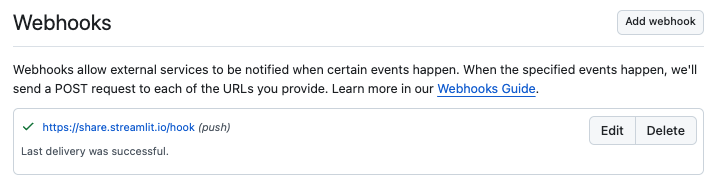

This is achieved through the GitHub webhook feature where external services can be notified when certain events happen (e.g. on push changes to `production` branch.


# Project Structure
The project follows the below structure.
```
IT3385_MLOPS
|-- pyproject.toml # dependency management
|-- poetry.lock # ensure deps version is constant
|-- Dockerfile # to build docker image
|-- .dockerignore
|-- .gitignore
|-- README.md
|-- configs/
|   |-- streamlit.yaml # config file for the streamlit app
|-- data/
|   |-- demo/ # sample files go here for testing the web app
|       |-- wheat.csv
|-- saved_models/
|   |-- wheat.pkl # saved pipelines as pickle file objects
|   |-- ...
|-- src/
|   |-- __init__.py # so that src gets recognised as a python package
|   |-- models/
|       |-- wheat
|           |-- model.py # abstract pycaret logic from streamlit pages file
|       |-- melbourne
|       |-- used_car_prices
|   |-- streamlit/
|       |-- Home.py # entry point for streamlit run
|       |-- pages # 3 different pages for the 3 different predictors
|           |-- 1_Wheat.py
|           |-- 2_Melbourne.py
|           |-- 3_Used_Car_Prices.py
|       |-- assets # custom styling, misc data
|       |-- logs # to keep logging generated from interface and predictor
```

> [!NOTE]
> `poetry.lock` is pushed to version control as well, as per recommendations for applications developer here: [https://python-poetry.org/docs/basic-usage/#as-an-application-developer](https://python-poetry.org/docs/basic-usage/#as-an-application-developer)

Config file stores the default values for the Streamlit app's pages, in `.yaml` form, read by [`omegaconf`](https://pypi.org/project/omegaconf/).


# Troubleshooting Common Problems

> `pipx` is not recognized as an internal or external command, operable program, or batch file

Here are some potential resolution for installing `pipx` on Windows
- Ensure it's install globally with the `--user` (or `-U`) flag (e.g. `python -m pip install --user pipx`)
- Ensure `pip` version is 19.0 or later (as specified in their [official installation guide](https://pipx.pypa.io/stable/installation/))
- Restart your terminal session to reload your shell profile so that the `pipx` executable path is included in your search path (e.g. close and open a new terminal window)

<hr>

> OSError: dlopen(/pypoetry/virtualenvs/it3385-mlops-arMP4vTn-py3.11/lib/python3.11/site-packages/lightgbm/lib/lib_lightgbm.dylib, 0x0006): Library not loaded: @rpath/libomp.dylib

On MacOS, you will need to install `libomp` as solved by a user here on [stackoverflow](https://stackoverflow.com/a/55958281).

```
brew install libomp
```

<hr>

Docker image build issues

> ERROR: failed to build: failed to solve: failed to fetch oauth token: unexpected status from GET request to https://auth.docker.io/token?scope=repository%3Alibrary%2Fpython%3Apull&service=registry.docker.io: 401 Unauthorized

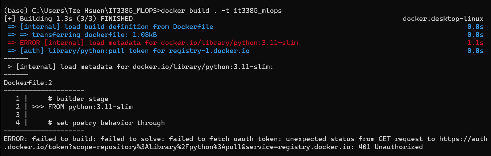
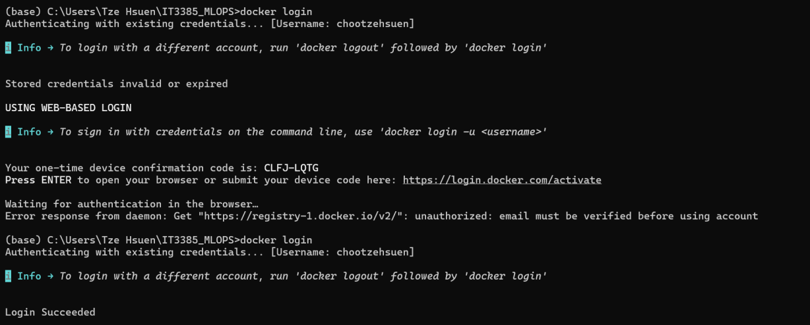

Resolution steps:
1. Ensure your Docker Hub account is verified (check your email for verification, Docker will visually let you know your account is un-verified )
2. `docker login`

<hr>

Poetry error

> pyproject.toml changed significantly since poetry.lock was last generated. Run poetry lock to fix the lock file.

Resolution steps:
1. Run `poetry lock`
2. Re-run `poetry install` next

Alternatively (though not recommended), you may delete the generated `poetry.lock`, afterwards it should automatically generate a new one again upon `poetry install`.

<hr>

Running Streamlit app, results in package not found

> ModuleNotFoundError: No module named 'omegaconf'

Resolution steps:
1. Ensure your `poetry install` worked without any errors, if there are, refer to the [installation guide](#source-setup) again or look above for any troubleshooting tips.
2. Ensure you are running python with the `poetry run` command (e.g. `poetry run python -m streamlit run /src/streamlit/Home.py`)

If all else fails, run `poetry env list` and `poetry env info` to get more information on your current environment.

You may then proceed to copy the path to the python executable/binary file as outputted by `poetry env info` to run streamlit.

E.g. `C:\Users\Tze Hsuen\AppData\Local\pypoetry\Cache\virtualenvs\it3385-mlops-a-750jKb-py3.11\Scripts\python.exe -m streamlit run src/streamlit/Home.py`

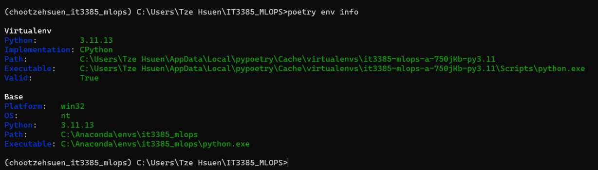
Output of `poetry env info`, notice the `Executable` attribute of the `virtualenv`.

<hr>

> Poetry could not find a pyproject.toml file in {DIR} or its parents.

Resolution steps:
1. Ensure your current working directory is the very root of this repository (on your local machine).

E.g. `(base) /Users/Tze Hsuen/IT3385_MLOPS`
